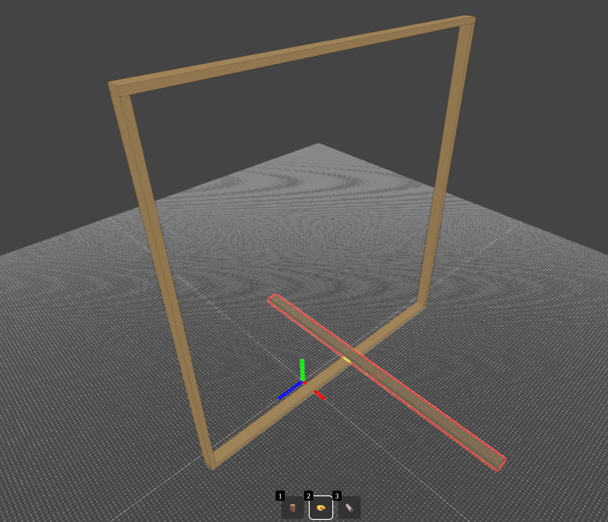

# LumberSketch
LumberSketch is a 3D web app for quickly sketching 3D models using actual lumber sizes (1.5" x 3.5" for 2x4s, etc.). It is built using Three.js

https://sladewasinger.github.io/LumberSketch/

# Roadmap
- [✅] Add x, y, & z axis to scene
- [✅] Label each axis
- [✅] Add ghost 2D projection of 2x4 beam under cursor
- [✅] Add snapping to other beams
- [✅] Add "align face" ability (hold [a] with select tool, click on 1st beam's face, click on 2nd beam's face)
- [✅] Add "place face on ground" ability (hold [f] with select tool, click on desired beam's face)
- [✅] Add "snap to axis" ability (hold [z], [x], or [c] with select tool, click and drag a beam along desired axis)
- [✅] Add "delete" ability (with select tool, select a beam, press [delete])
- [x] Add undo and redo functionality
- [x] Add copy and paste functionality
- [x] Add cut tool
    - [x] Add ability to cut along length of beam (use CursorProjection code)
    - [x] Add ability to type out exact length of cut (from edge of beam)
    - [x] Add ability for cut tool to snap to center of beam length
- [x] Add ability to type out exact dimensions of beam when placing (should update in real time)
- [x] Add tape measure tool 📏 for measuring distances between vertices
- [x] Add 
- [x] Add lumber shopping list breakdown feature
    - [x] Will give an optimized number of 8ft 2x4s tht are needed based on total length of beams, taking into account cuts/rounding error. For example, if you have 2 beams that are 4ft long, and 2 beam that are 6ft long, and 2 beams that are 2ft long, it will say you need 3 8ft 2x4s.
    - [x] Add configurable 2x4 lumber lengths (8ft, 10ft, 12ft, etc.)
- [x] Someday (near the end of the roadmap): Add ability to configure lumber sizes and lengths (8' 2x4, 10' 2x4, 10' 2x6, etc.)
